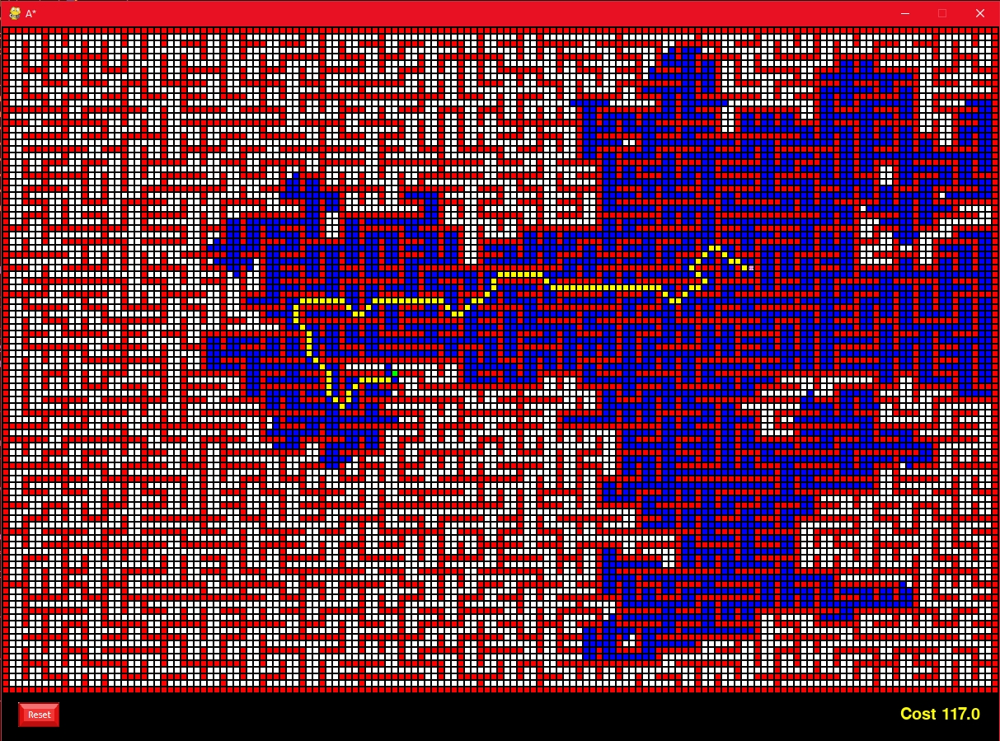

# Intelligent Systems

This repository contains the exercices that i've done during UA's Intelligent Systems assignature, meant to learn pathfinding algorithms, heuristics, and machine learning.

You'll find here my practices, exercices and theory PDFs aswell.
